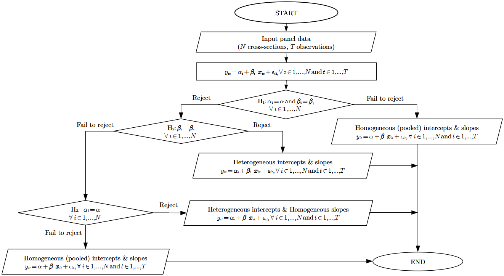

<!-- badges: start -->
[](https://CRAN.R-project.org/package=poobly)
[](https://github.com/cadam00/poobly)
[](https://github.com/cadam00/poobly/actions/workflows/R-CMD-check.yaml)
[](https://app.codecov.io/gh/cadam00/poobly)
<!-- badges: end -->

# **Hsiao Poolability test ([1986](#ref-hsiao1986);[2022](#ref-hsiao2022)) in R**

## **Install**

The development version of the package can be installed via
``` r
if (!require(remotes)) install.packages("remotes")
remotes::install_github("cadam00/poobly")
```

<!--
## **Citation**

To cite the official [(CRAN)](https://cran.r-project.org/) version of the
package, please use

<blockquote>
<p>Adam, C. (2025). corbouli: Corbae-Ouliaris Frequency Domain
Filtering. R package version 0.1.4. doi:<a
href="https://doi.org/10.32614/CRAN.package.corbouli"
class="uri">10.32614/CRAN.package.corbouli</a></p>
</blockquote>
-->

## **Hsiao Poolability test**

The Hsiao poolability/homogeneity test (Hsiao [1986](#ref-hsiao1986);
[2022](#ref-hsiao2022)) for panel data is used to determine the
homogeneity of coefficients across individuals in panel data. The test is
composed of three consecutive hypotheses. The hypothesis that slope and
intercept (constant) coefficients are the same across the panel is initially
tested. If this hypothesis is not rejected, then the total homogeneity (pool) of
both slopes and intercepts is concluded. If the first hypothesis is rejected,
the second hypothesis tests the homogeneity of the slope coefficients. If this
second hypothesis is rejected, different slope coefficients for all individuals
are indicated, suggesting total heterogeneity. If this hypothesis is not
rejected, then homogeneity of slope coefficients is implied. If this second
hypothesis is not rejected, then the the third hypothesis tests the homogeneity
of the intercept coefficients across individuals is performed. If
this last hypothesis is not rejected, then total homogeneity is resulted. If
this last hypothesis is rejected, equal slopes but different intercepts across
individuals are indicated. The current implementation is derived from Hsiao
([2022](#ref-hsiao2022)). This procedure is capitulated in Figure
[1](#ref-Figure1) and Table [1](#ref-table1).

<p align="center">
    
</p>
<p class="caption" align="center">
<span id="ref-Figure1"></span>
Fig. 1: Hsiao homogeneity hypothesis testing flow chart.
</p>

<table style="width: 368px; vertical-align: middle;
text-align: center; margin-left: auto; margin-right: auto;" border="1"
align="center">
<tbody>
<tr style="height: 26.75px;">
<td style="width: 136.65px; height: 26px;" align="center">
                                              &nbsp;<b>Hypothesis</b></td>
<td style="width: 136.65px; height: 26px;" align="center"><b>Null</b></td>
<td style="width: 186.65px; height: 26px;" align="center"><b>
                                                            Alternative</b></td>
</tr>
<tr style="height: 26px;" align="center">
<td style="width: 136.65px; height: 26px;" align="center">&nbsp;<b>H<sub>1</sub>
                                                                       </b></td>
<td style="width: 136.65px; height: 26px;" align="center">Pooled</td>
<td style="width: 186.65px; height: 26px;" align="center">H<sub>2</sub></td>
</tr>
</tr>
<tr style="height: 26px;" align="center">
<td style="width: 176.65px; height: 26px;" align="center">&nbsp;<b>H<sub>2</sub>
                                                                       </b></td>
<td style="width: 136.65px; height: 26px;" align="center">H<sub>3</sub></td>
<td style="width: 186.65px; height: 26px;" align="center">
                                          Heterogeneous intercepts & slopes</td>
</tr>
</tr>
<tr style="height: 26px;" align="center">
<td style="width: 136.65px; height: 26px;" align="center">&nbsp;<b>H<sub>3</sub>
                                                                       </b></td>
<td style="width: 136.65px; height: 26px;" align="center">Pooled</td>
<td style="width: 186.65px; height: 26px;" align="center">
                              Heterogeneous intercepts & Homogeneous slopes</td>
</tr>
</tbody>
</table>
<p align="center">
  <span class="nocase" id="ref-table1">
    Table 1: Hsiao homogeneity hypothesis testing table.
  </span>
</p>

## **Example**

For this example, the data `Gasoline` from <b>plm</b> R package will be
used.

``` r
# Import poobly and plm packages to workspace
library(poobly)
library(plm)

# Import "Gasoline" dataset
data("Gasoline", package = "plm")

# Print first 6 rows
head(Gasoline)
```
```
##   country year lgaspcar  lincomep      lrpmg  lcarpcap
## 1 AUSTRIA 1960 4.173244 -6.474277 -0.3345476 -9.766840
## 2 AUSTRIA 1961 4.100989 -6.426006 -0.3513276 -9.608622
## 3 AUSTRIA 1962 4.073177 -6.407308 -0.3795177 -9.457257
## 4 AUSTRIA 1963 4.059509 -6.370679 -0.4142514 -9.343155
## 5 AUSTRIA 1964 4.037689 -6.322247 -0.4453354 -9.237739
## 6 AUSTRIA 1965 4.033983 -6.294668 -0.4970607 -9.123903
```

A `pdata.frame` or a `data.frame` object is expected as and a formula are
required as minimum essential input for the `hsiao` function. Note that
`data.frame` object input should be able to be transformed as `pdata.frame`
object and `index` input can be used as well. For more about `pdata.frame` see
at `plm::pdata.frame`.


```r
# Hsiao hypothesis testing
x <- hsiao(lgaspcar ~ lincomep + lrpmg + lcarpcap, Gasoline)
print(x)
```
```
## 
##                     Hsiao Homogeneity Test
## 
## Hypothesis| Null |                 Alternative                 
## ----------+------+---------------------------------------------
##     H1    |Pooled|                    H2                       
##     H2    |  H3  |      Heterogeneous intercepts & slopes      
##     H3    |Pooled|Heterogeneous intercepts & homogeneous slopes
## ===============================================================
## 
## formula: lgaspcar ~ lincomep + lrpmg + lcarpcap
## 
##     Hypothesis  F-statistic     df1         df2       p-value  
##   1     H1       129.3166       68          270       < 0.001  
##   2     H2        27.3352       51          270       < 0.001  
##   3     H3        83.9608       17          321       < 0.001
```

According to this result, the coefficients of the given countries have both
heterogeneous intercept & slope. In detail, the first hypothesis, $H_1$, is
rejected in 1% statistical significance level, indicating strong evidence
against the $H_1$. Then, the second hypothesis, $H_2$, is tested and rejected as
well in 1% statistical significance level. This is the end of the testing and so
there is strong evidence that both intercept and slope are heterogeneous.

## **References**

<span class="nocase" id="ref-hsiao1986">
Hsiao, C. (1986) <em>Analysis of Panel Data</em>. 1st edn. Cambridge: Cambridge
University Press (Econometric Society Monographs).<br>

<span class="nocase" id="ref-hsiao2022">
Hsiao, C. (2022) <em>Analysis of Panel Data</em>. 4th edn. Cambridge: Cambridge
University Press (Econometric Society Monographs), pp. 43-49.
doi:<a href="https://doi.org/10.1017/9781009057745">10.1017/9781009057745</a>
